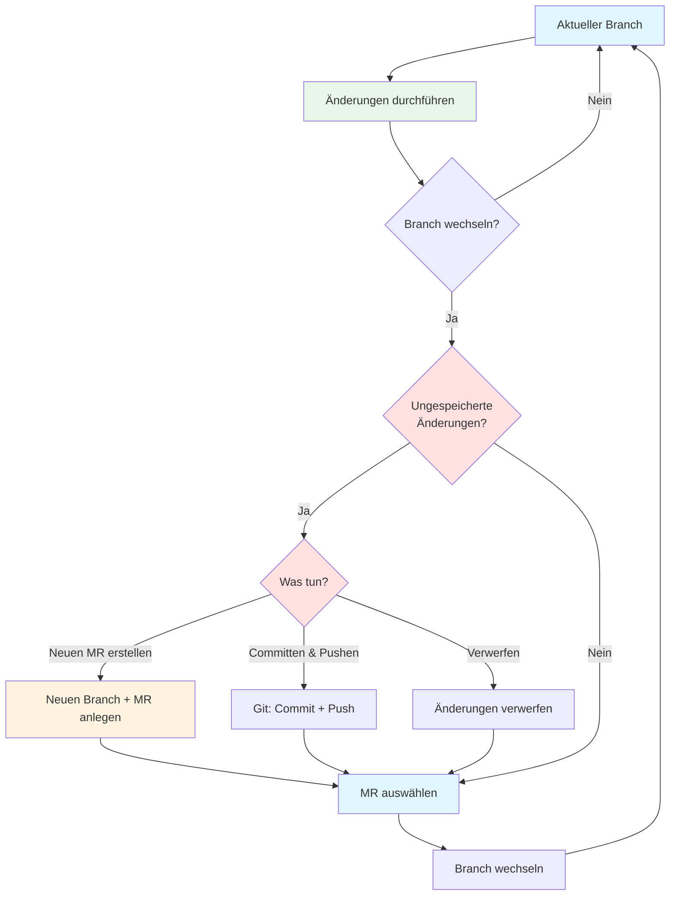

# GitLabVault

GitLabVault verbindet deinen Obsidian Vault mit GitLab - verwalte Merge Requests und Git-Operationen direkt in Obsidian.

## Features

- **GitLab Integration**
  - Merge Requests anzeigen und filtern
  - Nach Status, Autor, Labels filtern
  - Git-Commands-Toolbar für schnellen Zugriff
  - Branch-Selector mit priorisiertem main Branch

- **Git-Operationen**
  - Vault als Git-Repository verwalten
  - Commit, Push, Pull direkt aus Obsidian
  - Branch-Verwaltung (erstellen, wechseln, löschen)
  - Schneller Checkout zum main Branch
  - Git Status in der Status Bar

## Installation

### Entwicklung

1. Klone dieses Repository in deinen Obsidian Plugins Ordner
2. `pnpm install`
3. `pnpm run dev`
4. Aktiviere das Plugin in Obsidian

### Tests

```bash
pnpm test          # Watch Mode
pnpm test:run      # Run once
pnpm test:ui       # UI Mode
pnpm test:coverage # With coverage
```

### Linting

```bash
pnpm lint          # ESLint ausführen
pnpm lint:fix      # Auto-fix Probleme
```

## Release

Um eine neue Version zu veröffentlichen:

1. Aktualisiere `version` in `manifest.json` und `package.json`
2. Erstelle einen Git Tag:
   ```bash
   git tag -a 1.0.0 -m "Release 1.0.0"
   git push origin 1.0.0
   ```
3. Die GitHub Action erstellt automatisch einen Draft Release
4. Bearbeite den Release auf GitHub und veröffentliche ihn

Die Release-Dateien (`main.js`, `manifest.json`, `styles.css`) werden automatisch zum Release hinzugefügt.

## Konfiguration

1. Öffne die Plugin-Einstellungen
2. Trage deine GitLab URL ein
3. Erstelle ein Personal Access Token in GitLab (mit `api` und `read_repository` Scope)
4. Trage das Token in den Einstellungen ein

## Verwendung

### Merge Requests anzeigen

- Verwende den Command "GitLab: Show Merge Requests" aus der Command Palette
- Oder klicke auf das GitLab Icon in der linken Seitenleiste

### Git Operationen

- `Git: Commit` - Staged Änderungen committen
- `Git: Push` - Änderungen pushen
- `Git: Pull` - Änderungen pullen
- `Git: Switch Branch` - Branch wechseln
- `Git: Create Branch` - Neuen Branch erstellen
- `Git: Checkout Main` - Schnell zum main Branch wechseln

Alle Git-Commands sind auch über die Toolbar in der Merge Request View verfügbar.

### Vereinfachter Workflow für Merge Requests

Das Plugin ermöglicht dir, schnell zwischen verschiedenen Merge Requests zu wechseln, ohne manuell Git-Befehle ausführen zu müssen:



**Workflow-Prinzip:**

Der Workflow basiert auf einem flexiblen Prinzip: **Unveröffentlichte Änderungen können jederzeit in einem neuen Merge Request bereitgestellt werden**. Egal ob du auf dem Main Branch oder einem Feature-Branch arbeitest - du kannst deine Änderungen entweder direkt committen oder in einem neuen MR organisieren.

**Typischer Arbeitsablauf:**

1. **Änderungen durchführen**: Arbeite in deinem Vault auf einem beliebigen Branch (main oder Feature-Branch)
2. **Branch wechseln**: Wähle einen MR aus der Liste oder wechsle zu einem anderen Branch
3. **Änderungen behandeln**: Wenn du ungespeicherte Änderungen hast, hast du drei Optionen:
   - **Neuen MR erstellen**: Erstellt automatisch einen neuen Branch und Merge Request für deine Änderungen
   - **Committen & Pushen**: Speichert Änderungen im aktuellen Branch und lädt sie zu GitLab hoch
   - **Verwerfen**: Verwirft alle ungespeicherten Änderungen
4. **Weiterarbeiten**: Nach dem Branch-Wechsel kannst du im neuen Branch weiterarbeiten

**Vorteile:**

- **Flexibel**: Arbeite auf jedem Branch und entscheide später, wie du die Änderungen organisierst
- **Einfach**: Kein manuelles Git im Terminal nötig
- **Schnell**: Direkter Wechsel zwischen verschiedenen Merge Requests
- **Übersichtlich**: Alle offenen Merge Requests auf einen Blick
- **Keine Git-Kenntnisse nötig**: Commit, Push und Branch-Erstellung werden automatisch kombiniert
- **Sicher**: Änderungen werden nie verloren - du wirst immer gefragt, was damit passieren soll

## Lizenz

MIT License - siehe [LICENSE](LICENSE) Datei für Details.

Copyright (c) 2025 Jens Meinecke
